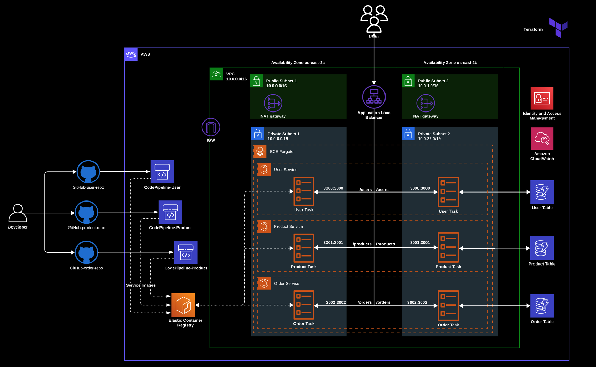

# AWS ECS on Fargate Terraform (Base Resources for Mircroservices Deployment) - User Service

[](https://www.terraform.io/)
[](https://aws.amazon.com/)

## Overview

This repository contains Infrastructure as Code (IaC) for setting up an ECS Service with Fargate launch type. The necessary base infrastructure is already setup in another parent repo which you can find [here](https://github.com/sagar-uprety/ecs-on-fargate-user-service)

The application is a simple e-commerce application with user details, product catalogue and order service.

## Main Architecture 



The base infrastructure implements a microservices architecture with the following key components:

- **VPC Configuration**
  - Dual Availability Zones (us-east-2a, us-east-2b)
  - Public and Private Subnets
  - NAT Gateways for private subnet connectivity
  - Internet Gateway for public access

- **Container Infrastructure**
  - ECS Fargate Cluster
  - ECS Services (Three Microservices) and Task ( **Note:** each microservice have it's own repo. Check them below)
  - Application Load Balancer
  - Elastic Container Registry (ECR)
  - Service Discovery

- **Microservices**
  - User Service (Port 3000)
  - Product Service (Port 3001)
  - Order Service (Port 3002)

- **Monitoring & Security**
  - CloudWatch Integration
  - Identity and Access Management (IAM)
  - Security Groups
  - Network ACLs

- **Data Layer**
  - Amazon DyanamoDB (3 Tables)
    - User Table
    - Product Table
    - Order Table

- **CI/CD**
  - AWS Codepipeline 
  - AWS Codebuild (also builds the microservices docker images)
  - GitHub as the source code repository

## Network Configuration

- VPC CIDR: 10.0.0.0/16
- Public Subnet 1: 10.0.0.0/16
- Public Subnet 2: 10.0.1.0/16
- Private Subnet 1: 10.0.32.0/19
- Private Subnet 2: 10.0.32.0/19

## Prerequisites

- AWS Account with appropriate permissions
- Terraform (>= 1.0.0)
- AWS CLI configured with credentials
- Docker installed locally
- Git

## Branch Information

- **main**: Complete infrastructure with CI/CD pipeline integration
- **ms**: Base infrastructure without pipeline integration


## Project Structure

* **`main.tf`**: Defines the core infrastructure for  ecs_service, and supporting resources
* **`buildspec*.yml`**: Defines the buildspec configuration required by AWS CodeBuild service
* **`variables.tf`**: Input variables for parameterization and sensitive data
* **`provider.tf`**: Specifies the AWS provider
* **`output.tf`**: Defines outputs such as Auto Scaling Group ID and RDS endpoint
* **`dev.tfvars`**: Variables specific to the dev environment
* **`versions.tf`**: Terraform version constraints and backend configuration 
* **`locals.tf`**: local value to be used in main.tf
* **`.pre-commit-config.yaml`**: git pre-commit configuration 
* **`.gitignore`**: Lists files to exclude from version control


## Related Microservices Repositories

The terraform configuration to deploy the other individual ECS services with CI/CD built-in are in separate repositories. Find them below:

1. [User Service](https://github.com/sagar-uprety/ecs-on-fargate-user-service)
2. [Product Service](https://github.com/sagar-uprety/ecs-on-fargate-product-service)

## Deployment Instructions (Quick Start Guide)

1. Clone the repository:
   ```bash
   git clone https://github.com/sagar-uprety/ecs-on-fargate-user-service.git
   cd ecs-on-fargate-user-service
   ```

2. Select the appropriate branch:
   ```bash
   # For pipeline version (CI/CD)
   git checkout main
   
   # For non-pipeline version (without CI/CD)
   git checkout ms
   ```

3. You need an S3 bucket as a backend for Terraform state. Create one if you have not already and update the  backend configuration in `versions.tf`:
   ```bash
   ...
   backend "s3" {
      bucket  = "dev-terraform-state-bucket" # update the bucket name here
      region  = "us-east-2"
      encrypt = true
      key     = "main/ecs-on-fargate-user.tfstate"
   }
   ...
   ```   

4. Initialize Terraform:
   ```bash
   terraform init
   ```

4. Configure your deployment:
   ```bash
   # Edit dev.tfvars with your configuration
   ```


5. Review the deployment plan:
   ```bash
   terraform plan --var-file="dev.tfvars"
   ```

6. Apply the infrastructure:
   ```bash
   terraform apply --var-file="dev.tfvars"
   ```

7. To destroy the infrastructure:
   ```bash
   terraform destroy --var-file="dev.tfvars"
   ```

## Contributing

1. Fork the repository
2. Create a feature branch:
   ```bash
   git checkout -b feature/your-feature-name
   ```
3. Commit your changes:
   ```bash
   git commit -m "Add your feature description"
   ```
4. Push to your fork:
   ```bash
   git push origin feature/your-feature-name
   ```
5. Create a Pull Request


## License

This project is licensed under [The MIT License](https://opensource.org/license/mit/).
