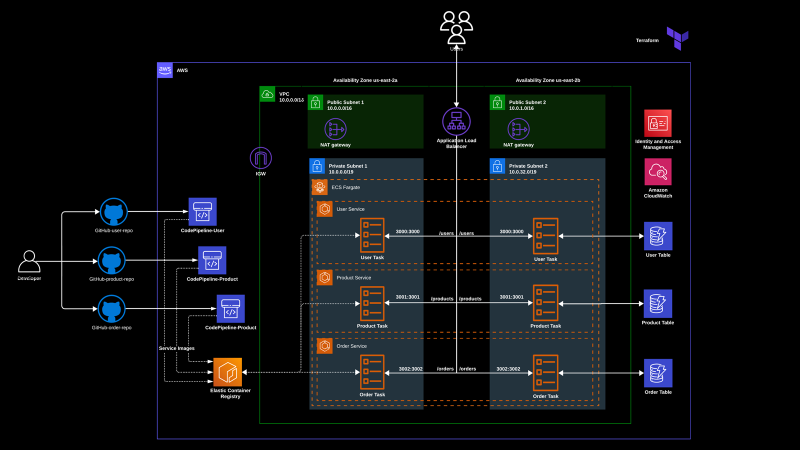

# Terraform AWS ECS Deployment for User Microservice - Node.Js

## Overview
This repository contains the Infrastructure as Code (IaC) for setting up the infrastructure necessary for deploying the user microservice. It leverages Terraform to automate the creation of essential AWS resources.

## About This Project
This project is a part of the comprehensive ECS Course by Adex, which covers various aspects of deploying and managing applications using AWS ECS. To learn more about the concepts and gain deeper insights into ECS, check out the [ECS Course by Adex](#).

## Prerequisites
- AWS Account
- Terraform installed
- Docker installed
- Completion or ongoing participation in the ECS Course by Adex is recommended for better understanding.

## Installation
To use this project, follow these steps:
1. Clone the repository: `git clone https://github.com/adexltd/lms-ecs-user-service`
2. Navigate to the cloned directory: `cd lms-ecs-user-service`
3. Checkout the required branch:
   - For pipeline version: `git checkout main`
   - For non-pipeline version: `git checkout ms`

## Getting Started

1. Run `terraform init` to initialize the provider and modules.
2. Run `terraform plan --var-file="dev.tfvars"` to see the changes that will be made.
3. Run `terraform apply --var-file="dev.tfvars"` to apply the changes.
4. **Caution:** Run `terraform destroy --var-file="dev.tfvars"` to destroy and cleanup all the resources.

## Project Structure

- `main.tf`:  This file is executed by Terraform to create, modify, or destroy the resources defined in it.
- `variable.tf`: Variables can be used for a variety of purposes such as storing sensitive information, providing inputs to resources, or defining defaults for a module.
- `versions.tf`: The versions.tf file in Terraform is used to set constraints on the Terraform version required for working with the configuration files.
- `provider.tf`: The provider blocks in Terraform configuration files represent the cloud infrastructure or services that be managed by Terraform. Providers allow Terraform to deploy and manage resources in different cloud environments such as AWS, Azure, Google Cloud Platform, and more.
- `output.tf`: Description of what this file does.
- `.gitignore`: List of files to ignore in version control.
- `.pre-commit-config.yaml`: Configuration file for pre-commit hooks.

## Microservices Repositories
This project is part of a larger ecosystem comprising individual microservices. If you are running the code from *main* branch, you do not need to apply the IaaC for individual microservices as the pipeline will automatically do that for you. However, if you plan to don't use the CI/CD pipeline and run the code from *ms* brach, go ahead and apply the terraform code for each microservices. The IaaC for these services can be found in the following repositories:
1. [Microservice 1 - User Repository](https://github.com/adexltd/lms-ecs-user-service)
2. [Microservice 2 - Product Repository](https://github.com/adexltd/lms-ecs-product-service)
3. [Microservice 3 - Order Repository](https://github.com/adexltd/lms-ecs-order-service)

## Architecture

## Contributing
Contributions to this project are welcome. Please follow these steps:
1. Fork the repository
2. Create a new branch: `git checkout -b feature-branch`
3. Commit your changes and push to the branch
4. Create a pull request

## License
This repo is licensed under [The MIT License](https://opensource.org/license/mit/)

## Contact
For questions or feedback, contact the course instructor [Sagar Uprety](https://bio.link/sagaruprety) at [sagar.uprety@adex.ltd].
